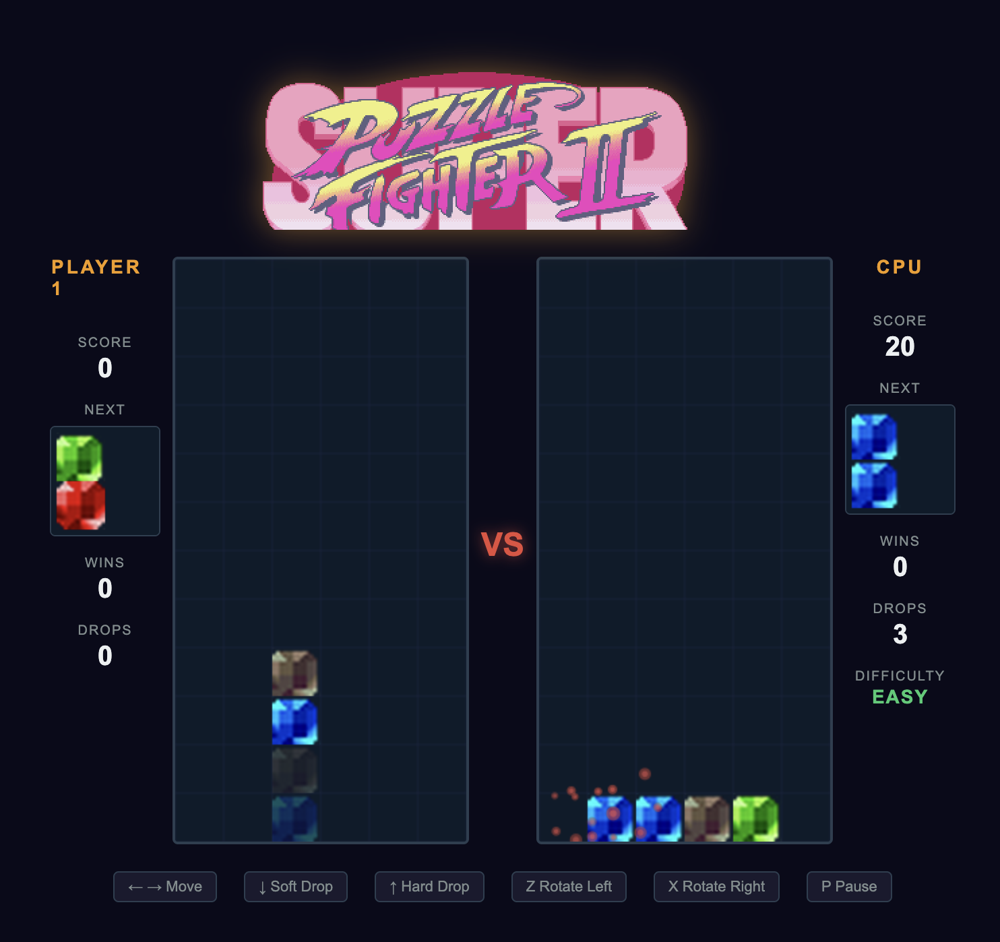

# Puzzle Fighter - JRG
## Description
Super Puzzle Fighter is a browser-based competitive puzzle game inspired by Super Puzzle Fighter II Turbo, built entirely with HTML5 Canvas, CSS, and vanilla JavaScript. Two players — a human (Player 1) and an AI opponent (Player 2) — face off on side-by-side 6×12 grids, where pairs of colored gems (red, blue, green, yellow) fall from the top. Players must strategically stack and match gems, using special Crash Gems to destroy all connected same-color gems in chain reactions, sending counter gems to their opponent's board. The game also features Rainbow Gems that destroy all gems of a single color, a combo/chain scoring system, and pending counter gem warnings.

## Prompts (using Claude Opus 4.6 High)
### First Functional Design - MVP
As a video game design expert, I would like you to create a game similar to Super Puzzle Fighter II using HTML, CSS, and JavaScript. Once you have reviewed the game, please outline the incremental development phases along with the expected deliverables for each stage.

Context:
    - Super Puzzle Fighter II: brief game overview https://game.capcom.com/manual/CFC/es419/ps4/page/8/1
    - PlayStation game manual: https://www.videogamemanual.com/ps1/Super%20Puzzle%20Fighter%20II%20Turbo%20(USA).pdf

#### Improve the difficulty of the game
The opponent's difficulty is too high; I need them to make decisions more slowly. It's very difficult to beat them. Find a way to increase the difficulty depending on whether the player wins more than 1, 2, or 3 games in a row. Also the number of Crash Gems that the player receives is very low, increase it to 30%

## Visual Assets - Sprites
Add better visual assets (sprites) for the videogame using this the resources in:
    - Green gems: https://www.spriters-resource.com/arcade/superpuzfightiiturb/asset/236867/
    - Red gems: https://www.spriters-resource.com/arcade/superpuzfightiiturb/asset/27964/
    - Blue gems: https://www.spriters-resource.com/arcade/superpuzfightiiturb/asset/236869/
    - Black gems: https://www.spriters-resource.com/arcade/superpuzfightiiturb/asset/236870/ 
    - Title: https://www.spriters-resource.com/arcade/superpuzfightiiturb/asset/92326/
    - Texts (Win, Lose, KO, Ready, Fight, VS, etc): https://www.spriters-resource.com/arcade/superpuzfightiiturb/asset/44456/ 

#### Improving Sprites and adding explosions
- Remove the pink borders in the sprites
- Add explosions efects when a gem Crash Gems destroy all connected same-color.

#### Improving Header
I did a manual fix removing extra content from the image. No prompt needed for this.

## Audio effects
I've uploaded a set of sounds in ./assets/sounds
I want you to apply the sounds this way:

DROP.wav when the user click on Soft or Hard Drop
EXPLOSION.wav when the gems explode
PAUSE.wav when the user press P for pause
READY.wav when the game is loaded, at the beginning
FIGHT.wav when the user click on START GAME button
HIT_FLOOR.wav when any gem hit the botton of the board
ROTATE_.wav press Z or X to rotate the gems
YOU_WIN.wav when the user win a game
YOU_LOSE.wav when the user lose a game
KEN_SOUNDTRACK.flac after FIGHT.wav

### Fixing initial sound
READY.wav is not being heard at the beginning

## Changing the title
Using ChatGPT, providing the previous title image I asked for another one with the same style:
- I want another image with the same style with the text "Puzzle Fighter - JRG"

